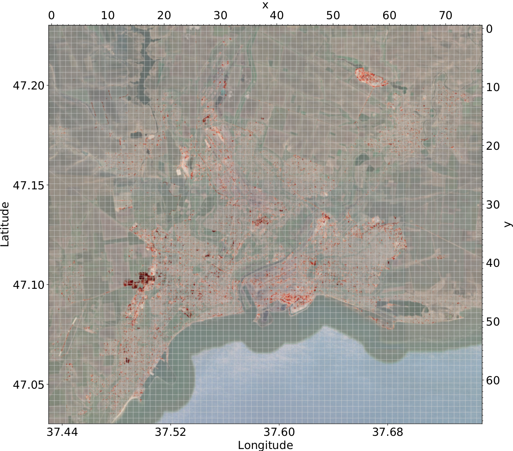

# Monitoring Urban Changes in Mariupol/Ukraine

This repository demonstrates the transferred ERCNN-DRS to monitor urban changes in Mariupol/Ukraine in 2022/23.

Prediction values (probabilities) over all detected urban changes with a hald-year sliding window, on a static background (for reference only) and superimposed in colors according to the legend (Nov. 2021 - Sept. 2023):

https://github.com/It4innovations/urban_change_monitoring_mariupol_ua/assets/39556069/fe969481-70be-4d22-84a1-1de2a2c2e07e

This video is located in this repository [here](./images/Mariupol_11_2021-09_2023_background.mp4).

We continue to update the visualizations as time progresses. The ones from the paper (see below) are available as well.

Maximum values over all detected urban changes with a sliding window, superimposed in red (Nov. 2021 - Sept. 2023):

  

The older counterparts from the paper and following months can be found [here](./images/).

Prediction values (probabilities) over all detected urban changes with a hald-year sliding window (Nov. 2021 - Sept. 2023):

  

Video file is located [here](./images/Mariupol_11_2021-09_2023.mp4).

The older counterparts from the paper and following months can be found [here](./images/).

**Note:**
These visualizations were created with 93x93 tiles and an 8 pixel overlap (dead zone of 4 in *rsdtlib*) to provide a seamless presentation without the issues of tile borders.

The urban changes were detected and monitored with a transferred version of the pre-trained [ERCNN-DRS model](https://github.com/It4innovations/ERCNN-DRS_urban_change_monitoring) for Sentinel 1 & 2 missions.

The windowed observations were pre-processed with [rsdtlib](https://github.com/It4innovations/rsdtlib). This library downloads all Sentinel 1 & 2 observations from [Sentinel Hub](https://www.sentinel-hub.com/) and pre-processes the observations for time series analysis (windowing). This library was used for training and inference. We used as time frame November 2021 up to today (July 2023), with sliding windows of six month duration.

# Training/Validation Datasets
Thanks to the data providers, we can make available the [`training/validation datasets`](https://drive.google.com/drive/folders/1_aPnm4T2rZM6K2cJ2FAX4x_uHWWURJVs?usp=sharing) on Google Drive.

**Note:** The training/validation datasets are `TFRecord` files, with one file for each tile and each tile containing all windows from 2017-2020. Two features are availble, with one describing the time series of observations for each window and a label. The label is the synthetic ground truth which is not used for transfer learning! Instead labels need to be loaded separately from folder [`training/numpy_ground_truth`](./training/numpy_ground_truth/).

**ATTENTION, these files are large!**
- [V1](https://drive.google.com/file/d/17KxCrS0hlNqKqHIgNFuQjh4jLuz-S2_G/view?usp=sharing) [149.76 GB]
- [V2](https://drive.google.com/file/d/1xarhnQqY7dWkhDZWxqedhezB0Q1fxzmV/view?usp=sharing) [149.76 GB]
- [V3](https://drive.google.com/file/d/1YW533A20qJX3pB_IpLeqFIJ-jY79LayV/view?usp=sharing) [149.76 GB]
- [V4](https://drive.google.com/file/d/1JdRJFGlR7sxkVO2In78Cn7M_OeDefT13/view?usp=sharing) [149.76 GB]

Extract the tar balls `V[1-4].tar` in the respective subdirectories [`./training/V1/`](./training/V1/), [`./training/V2/`](./training/V2/), [`./training/V3/`](./training/V3/), and [`./training/V4/`](./training/V4/).

Versions `V[1-4]` are using different subsets of tiles for training, with valiation tiles being disjunct.

# Training
Execute the training script [`training/train.py`](./training/train.py). It is recommended to use the NVIDIA GPU Cloud Tensorflow container [`docker://nvcr.io/nvidia/tensorflow:22.02-tf2-py3`](https://catalog.ngc.nvidia.com/orgs/nvidia/containers/tensorflow) and at least eight GPUs with a total of 320 GB of memory (8x40 GB).

Change the variable `exp` to the version to train, e.g. `exp = "V1"`.

# Trained Models
We provide all trained [`models`](./models/):
- Pre-trained model:
  - [`baseline.hdf5`](./models/baseline.hdf5): see [original work](https://github.com/It4innovations/ERCNN-DRS_urban_change_monitoring)
- Transferred models:
  - [`V1_transfer_116.h5`](./models/V1_transfer_116.h5): First transferred model from partial cross-validation (epoch 116)
  - [`V2_transfer_113.h5`](./models/V2_transfer_113.h5): Second transferred model from partial cross-validation (epoch 113)
  - [`V3_transfer_146.h5`](./models/V3_transfer_146.h5): Third transferred model from partial cross-validation (epoch 146)
  - [`V4_transfer_109.h5`](./models/V4_transfer_109.h5): Fourth transferred model from partial cross-validation (epoch 109)

# Other Use Case
The basic transfer method has been used to monitor urban changes in Liège/Belgium 2017-2020. That use case is hosted as a dedicated project [here](https://github.com/It4innovations/ERCNN-DRS_urban_change_monitoring/tree/main/transfer).

# Paper and Citation
The full paper can be found at [arXiv](https://doi.org/10.48550/arXiv.2309.08607).

    @misc{zitzlsberger2023monitoring,
          title={Monitoring Urban Changes in Mariupol/Ukraine in 2022/23}, 
          author={Georg Zitzlsberger and Michal Podhoranyi},
          year={2023},
          eprint={2309.08607},
          archivePrefix={arXiv},
          primaryClass={cs.CY},
          doi={10.48550/arXiv.2309.08607},
          url={https://doi.org/10.48550/arXiv.2309.08607}
    }

# Contact
Should you have any feedback or questions, please contact the main author: Georg Zitzlsberger (georg.zitzlsberger(a)vsb.cz).

# Acknowledgments
This research was funded by the Ministry of Education, Youth and Sports from the National Programme of Sustainability (NPS II) project “IT4Innovations excellence in science - LQ1602” and by the IT4Innovations Infrastructure, which is supported by the Ministry of Education, Youth and Sports of the Czech Republic through the e-INFRA CZ (ID:90140), and via the Open Access Grant Competition (OPEN-25-24 and OPEN-27-1). This work was also supported by ESA Network of Resources Initiative to provide access to Sentinel Hub, and Airbus Pléiades.

We also would like to thank CESNET Meta Centrum for providing us access to a DGX H100 node.

# License
This project is made available under the GNU General Public License, version 3 (GPLv3).

# Disclaimer
This work and results is active research and subject of change. They hence are provided "as is", without guarantee of correctness or liability. Use at your own risk.

# Ethical Statement
Due to the ongoing Russian-Ukrainian war, the selection of locations of visual samples was done with care to minimize risks of influence and harm. To the best of our knowledge, we only selected locations and data that did not give direct insight to the ongoing war, but only documented the resulting (urban) changes. We also would like to underline that our monitoring methods used six-month windows and hence did not and shall not provide real-time information that could be used for military purposes. Our methods are optimized for inertial urban changes that manifest over longer periods.
